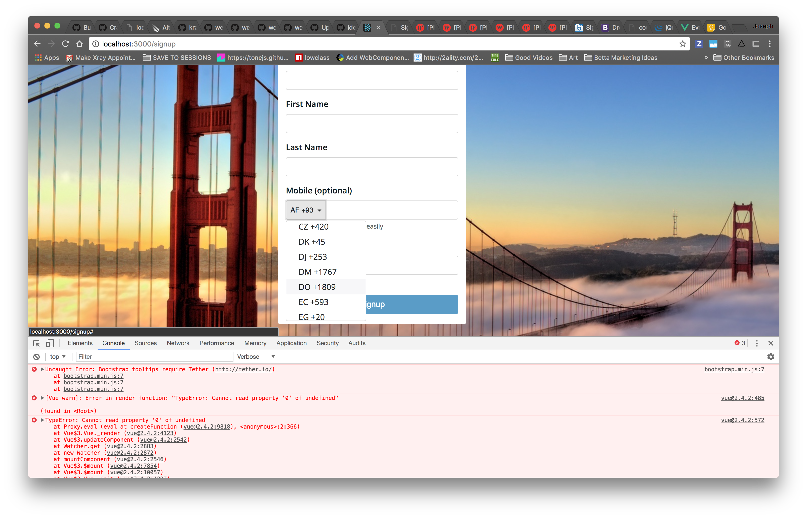

This is a *bare-minimum* template to create a Jekyll site that uses the [Just the Docs] theme. You can easily set the created site to be published on [GitHub Pages] – the [README] file explains how to do that, along with other details.

<!-- Test{: .label .label-yellow } -->

Deprecated
{: .label .label-red }
April 2024
{: .label .label-yellow }

| XYZ | Differential Robotics Development Platform |
|:-------------:|:------------------:|
|   Developed an low cost 3 Dimensional Dead Reckoning System, that will assist the gps and provide navigational support in absence of GPS signal or when the signal is weak. We used the IMU of GY5-21, ADXL-345 etc. for the Implementation. |  Developed an low cost 3 Dimensional Dead Reckoning System, that will assist the gps and provide navigational support in absence of GPS signal or when the signal is weak. We used the IMU of GY5-21, ADXL-345 etc. for the Implementation.
[Read More](#link_0){: .btn .btn-green .fs-4 .mb-2 .mb-md-0 .mr-2 } | [Read More](#link_0){: .btn .btn-blue .fs-4 .mb-2 .mb-md-0 .mr-2 } | 

<!-- | Fab-able Low Cost Drones & Custom FlightController Firmware | Quadraped Robotics Platform |
|:-------------:|:------------------:|
|   [Read More](#link_0){: .btn .btn-green .fs-4 .mb-2 .mb-md-0 .mr-2 }           |   [Read More](#link_0){: .btn .btn-green .fs-4 .mb-2 .mb-md-0 .mr-2 } |  -->

| Warehouse Automation- eYRC | Human Wildlife Conflict- Fab 2023 Bhutan |
|:-------------:|:------------------:|
|   Developed an low cost 3 Dimensional Dead Reckoning System, that will assist the gps and provide navigational support in absence of GPS signal or when the signal is weak. We used the IMU of GY5-21, ADXL-345 etc. for the Implementation. |  Developed an low cost 3 Dimensional Dead Reckoning System, that will assist the gps and provide navigational support in absence of GPS signal or when the signal is weak. We used the IMU of GY5-21, ADXL-345 etc. for the Implementation.
[Read More](#link_0){: .btn .btn-green .fs-4 .mb-2 .mb-md-0 .mr-2 } | [Read More](#link_0){: .btn .btn-green .fs-4 .mb-2 .mb-md-0 .mr-2 } | 

| Automotive Grade Dead Reconking for Telematic Devices | Oxygen Concentrator Monitoring System |
|:-------------:|:------------------:|
|   [Read More](#link_0){: .btn .btn-green .fs-4 .mb-2 .mb-md-0 .mr-2 }           |   [Read More](#link_0){: .btn .btn-green .fs-4 .mb-2 .mb-md-0 .mr-2 } | 

| Locomotion & Odometry of 3 Wheel Holonomic Drive | Low Cost Wireless HID Device Development & Analysis |
|:-------------:|:------------------:|
|   [Read More](#link_0){: .btn .btn-green .fs-4 .mb-2 .mb-md-0 .mr-2 }           |   [Read More](#link_0){: .btn .btn-green .fs-4 .mb-2 .mb-md-0 .mr-2 } | 

| [Open Source] Interfacing Proprietary HID Devices via Native USB on Teensy 4.1 | Android Application for Image Processing and Object Detection |
|:-------------:|:------------------:|
|   [Read More](#link_0){: .btn .btn-green .fs-4 .mb-2 .mb-md-0 .mr-2 }           |   [Read More](#link_0){: .btn .btn-green .fs-4 .mb-2 .mb-md-0 .mr-2 } | 

| Real Time Custom Object Detection using Open CV and Raspi 4B | Algorithm for Robot path rectification using IMU |
|:-------------:|:------------------:|
|   [Read More](#link_0){: .btn .btn-green .fs-4 .mb-2 .mb-md-0 .mr-2 }           |   [Read More](#link_0){: .btn .btn-green .fs-4 .mb-2 .mb-md-0 .mr-2 } | 

| Object Detection using IMU | Electronic Attendance Module |
|:-------------:|:------------------:|
|   [Read More](#link_0){: .btn .btn-green .fs-4 .mb-2 .mb-md-0 .mr-2 }           |   [Read More](#link_0){: .btn .btn-green .fs-4 .mb-2 .mb-md-0 .mr-2 } | 

| Speedometer Odometer & Telemetry for E-Bike | Regional Power Generation Predictor |
|:-------------:|:------------------:|
|   [Read More](#link_0){: .btn .btn-green .fs-4 .mb-2 .mb-md-0 .mr-2 }           |   [Read More](#link_0){: .btn .btn-green .fs-4 .mb-2 .mb-md-0 .mr-2 } | 

| Proctored Examination Software | Project Management System Software |
|:-------------:|:------------------:|
|   [Read More](#link_0){: .btn .btn-green .fs-4 .mb-2 .mb-md-0 .mr-2 }           |   [Read More](#link_0){: .btn .btn-green .fs-4 .mb-2 .mb-md-0 .mr-2 } | 

<!-- | Weather Predictor ML | Sudoku Solver AI |
|:-------------:|:------------------:|
|   [Read More](#link_0){: .btn .btn-green .fs-4 .mb-2 .mb-md-0 .mr-2 }           |   [Read More](#link_0){: .btn .btn-green .fs-4 .mb-2 .mb-md-0 .mr-2 } |  -->

| Dustbin for Dry Garbage | Water Wastage Controller |
|:-------------:|:------------------:|
|   [Read More](#link_0){: .btn .btn-green .fs-4 .mb-2 .mb-md-0 .mr-2 }           |   [Read More](#link_0){: .btn .btn-green .fs-4 .mb-2 .mb-md-0 .mr-2 } | 

----

[^1]: [It can take up to 10 minutes for changes to your site to publish after you push the changes to GitHub](https://docs.github.com/en/pages/setting-up-a-github-pages-site-with-jekyll/creating-a-github-pages-site-with-jekyll#creating-your-site).

[Just the Docs]: https://just-the-docs.github.io/just-the-docs/
[GitHub Pages]: https://docs.github.com/en/pages
[README]: https://github.com/just-the-docs/just-the-docs-template/blob/main/README.md
[Jekyll]: https://jekyllrb.com
[GitHub Pages / Actions workflow]: https://github.blog/changelog/2022-07-27-github-pages-custom-github-actions-workflows-beta/
[use this template]: https://github.com/just-the-docs/just-the-docs-template/generate
